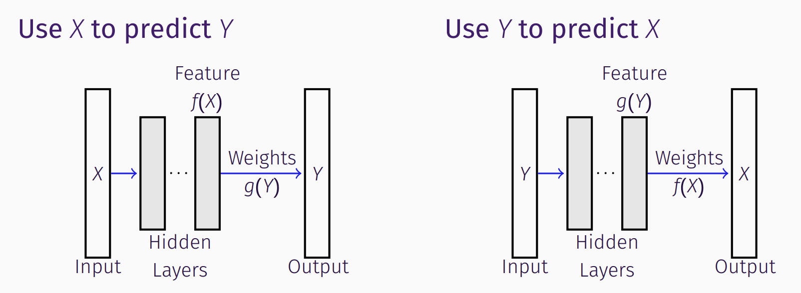

# dnn_symmetry
To verify the symmetry of Feature and Weights in DNNs, the weights for Y-X network (right) should coincide with the feature extracted by X-Y network (left):

### References 
[1] Xu, Xiangxiang, Shao-Lun Huang, Lizhong Zheng, and Lin Zhang. "[The geometric structure of generalized softmax learning](https://xiangxiangxu.com/media/documents/itw2018_ps.pdf)." In 2018 IEEE Information Theory Workshop (ITW), pp. 1-5. IEEE, 2018.
